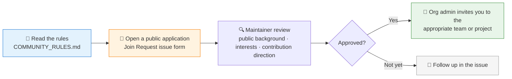

# 🤝 Join QUANTSKILLS

[简体中文](README.md) | **English**

  
  
  
  

This repository is the public application entrance for joining the **QUANTSKILLS community**.

QUANTSKILLS is an open community for **Quant Skills, Agents, and Strategies**. We welcome contributors interested in quantitative research, strategy development, AI Agent workflows, market data tools, documentation, and community operations.

> Before applying, please read the community rules: [COMMUNITY_RULES.md](COMMUNITY_RULES.md)

---

## ⚡ Application Flow

1. Submit a public join request through the Issue Form.
2. Maintainers review your public background, interests, and possible contribution direction.
3. Maintainers check that you understand the community rules.
4. If approved, an organization administrator will invite you to the appropriate QUANTSKILLS team or project.

## 📝 Apply to Join

👉 **[Open a public join request](https://github.com/quantskills/join/issues/new?template=join-request.yml)**

### 🔒 Do not include private information

Join requests are **public**. Do not submit:

| 🚫 Do not submit | 🚫 Do not submit |
|---|---|
| Phone number | Government ID |
| WeChat ID | Passwords |
| Email address | API keys |
| — | Private account credentials |

## 🧩 What You Can Contribute

| Direction | Content |
|---|---|
| 🛠️ Skill development | Build and maintain quant skill packages |
| 🤖 Agent workflows | Design and implement AI Agent workflows |
| 📈 Strategy replication | Replicate strategies from papers / research reports |
| 🧮 Factor research | Alpha factor research and validation |
| 📊 Data & backtesting | Market data and backtesting tools |
| 📚 Documentation | Documentation, tutorials, and examples |
| 🔧 Community maintenance | Issue / Pull Request / community maintenance |
| 🔍 Project review | Project review and research reports |

## 🏛️ Repository Ownership and Governance

If a member creates a repository under the `quantskills` organization, the repository is hosted and governed within the QUANTSKILLS organization:

- The **creator** may maintain the project, update code, manage documentation, and handle Issues or Pull Requests for that repository according to the permissions granted to them;
- The **original author** keeps authorship, credit, and contribution history for their work;
- **Organization owners** retain final governance rights for repositories hosted under `github.com/quantskills`, including the right to rename, archive, transfer, restrict access to, or delete repositories when necessary.

Member-created repositories are considered **Community Projects** by default. They do not automatically represent official QUANTSKILLS validation or endorsement. Projects may later be reviewed and marked as **Listed, Runnable, or Verified** according to community rules.

## 🎯 Principle

> **Low barrier to join, high standard for verification.**
