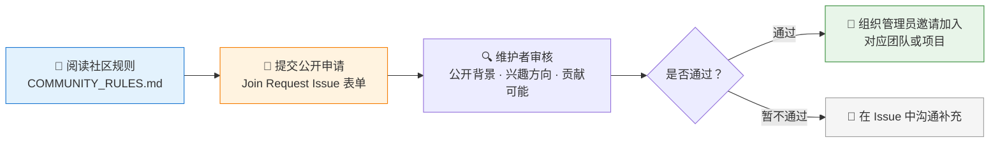

# 🤝 加入 QUANTSKILLS

**简体中文** | [English](README.en.md)

  
  
  
  

本仓库是加入 **QUANTSKILLS 社区**的公开申请入口。

QUANTSKILLS 是一个面向 **Quant Skills（量化技能）** 和 **Agents（智能体）** 的开放社区。我们欢迎对量化研究、策略开发、AI Agent 工作流、行情数据工具、文档建设和社区运营感兴趣的贡献者。

> 申请前请先阅读社区规则：[COMMUNITY_RULES.md](COMMUNITY_RULES.md)

---

## ⚡ 申请流程

1. 通过 Issue 表单提交公开加入申请。
2. 维护者审核你的公开背景、兴趣方向和可能的贡献方向。
3. 维护者确认你已理解社区规则。
4. 审核通过后，组织管理员会邀请你加入对应的 QUANTSKILLS 团队或项目。

## 📝 提交申请

👉 **[点此提交公开加入申请](https://github.com/quantskills/join/issues/new?template=join-request.yml)**

### 🔒 请勿在申请中包含隐私信息

申请是**公开的**，请不要提交：

| 🚫 禁止提交 | 🚫 禁止提交 |
|---|---|
| 手机号 | 政府证件号 |
| 微信号 | 密码 |
| 邮箱地址 | API Key |
| — | 私人账户凭证 |

## 🧩 可以贡献什么

| 方向 | 内容 |
|---|---|
| 🛠️ Skill 开发 | 量化技能包的开发与维护 |
| 🤖 Agent 工作流 | AI Agent 工作流的设计与实现 |
| 📈 投研 Skill | 论文/研报复现、策略模板与验证说明 |
| 🧮 因子研究 | Alpha 因子研究与有效性验证 |
| 📊 数据与回测 | 行情数据与回测工具 |
| 📚 文档建设 | 文档、教程与示例 |
| 🔧 社区维护 | Issue / Pull Request / 社区维护 |
| 🔍 项目评审 | 项目评审与研究报告 |

## 🏛️ 仓库归属与治理

成员在 `quantskills` 组织下创建的仓库，由 QUANTSKILLS 组织托管和治理：

- **创建者**可按授予的权限维护项目、更新代码、管理文档、处理 Issue 与 PR；
- **原作者**保留作品的署名、荣誉与贡献历史；
- **组织所有者**保留 `github.com/quantskills` 下仓库的最终治理权，必要时可重命名、归档、转移、限制访问或删除仓库。

成员创建的仓库默认为 **Community Project（社区项目）**，不自动代表 QUANTSKILLS 官方验证或背书；后续可按社区规则评审，标记为 **Listed / Runnable / Verified**。

## 🎯 原则

> **低门槛加入，高标准验证。**

## 🐼 PandaAI / QUANTSKILLS 社群

  
   
  扫码加入 PandaAI 社群，交流 QUANTSKILLS 技能、Agent 工作流与量化研究实践。

